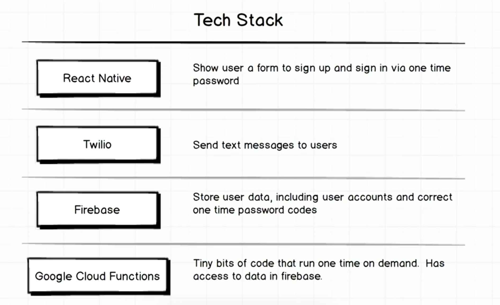
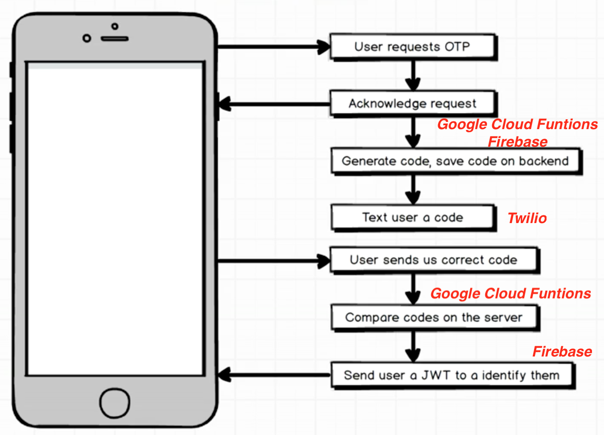
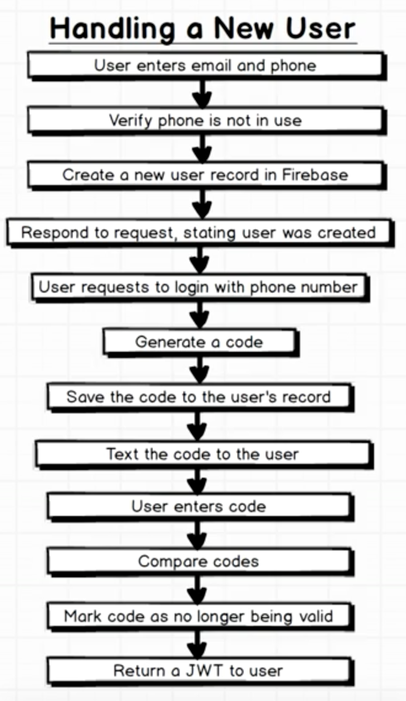

# Firebase Auth one time password, Udemy tutorial
Simple app, following advanced Udemy [React Native: Advanced Concepts course](https://www.udemy.com/react-native-advanced/learn/v4/overview)
## Main Goal
Practice more advanced React Native concepts and integrating the app to the external tools such as Firebase, Google Cloud Functions and Twilio.
To test the client app please navigate to **firebase-auth-client-app** folder,
To see the server side Google Cloud Functions please navigate to **one-time-password-server** folder. Note that server folder API keys are hidden, please refer to `.gitignore` file and include them with your own keys.


### [Demo - Try it on Expo, coming soon](https://expo.io/@jkhusanov/firebase-auth-client-app)

## Demo, coming soon


## Getting started

```
git clone https://github.com/jkhusanov/firebase-auth-udemy.git

cd firebase-auth-client-app

exp start

exp ios
```


## TODO

- [x] Create **Firebase** project 🔥
- [x] Set up local Firebase project 🔥
- [x] Write function to create a user, **Google Cloud Functions** ☁️
- [x] Sign up for **Twilio** 📞
- [ ] Write function to generate code and text a user
- [ ] Write function to verify code
- [ ] Attach the screenshots/gif of screens to `README.MD`

## Wireframes and project plan


<div style={{display: flex; flex-direction: row}}>
  
  <p>Tech stack</p>
  
  <p>App flow</p>
  
  <p>App flow in details</p>
</div>


